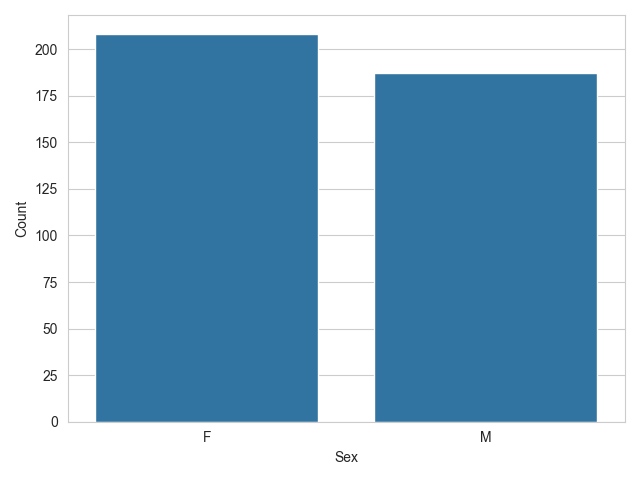
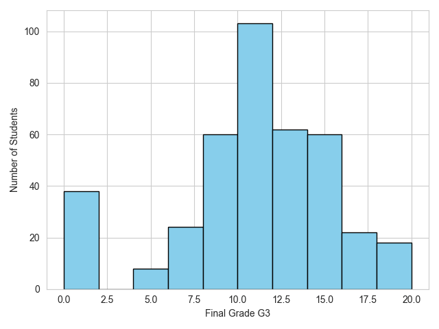
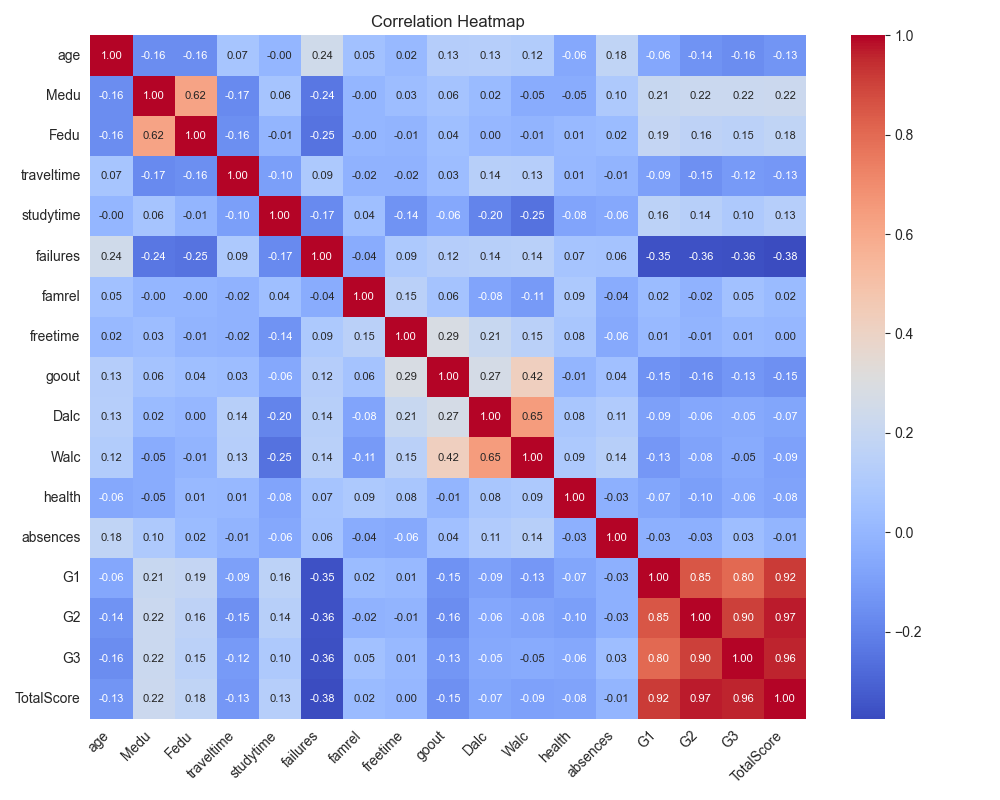

# Student Exam Performance Analytics Dashboard

[](https://www.python.org/downloads/)
[](https://opensource.org/licenses/MIT)
[](https://streamlit.io/)

A comprehensive analytical dashboard for exploring student academic performance metrics with interactive visualizations and statistical insights.



*Sample Gender Distribution Visualization*

## 📌 Key Features

### Data Management
- **CSV File Handler**: Supports semicolon-delimited datasets (e.g., UCI's Student Performance Dataset)
- **Auto-Cleaning Pipeline**:
  - Duplicate removal
  - Null value handling
  - Derived metrics calculation (`TotalScore = G1 + G2 + G3`)

### Advanced Analytics
- **Demographic Analysis**: 
  - Gender distribution metrics
  - Grade dispersion by gender
- **Academic Performance**:
  - Final grade (G3) distribution histogram
  - Multi-stage grade correlations (G1-G3)
- **Feature Relationships**:
  - Interactive correlation matrix with heatmap
  - Statistical relationship visualization

## 🛠️ Technical Stack
- **Frontend**: Streamlit
- **Data Processing**: Pandas
- **Visualization**: Matplotlib + Seaborn
- **Environment**: Python 3.8+

## 📥 Installation & Setup

### Prerequisites
```bash
git clone https://github.com/your-repo/student-performance-dashboard.git
cd student-performance-dashboard
python -m venv venv
source venv/bin/activate  # Linux/Mac
venv\Scripts\activate     # Windows
```

### Dependency Installation
```bash
pip install -r requirements.txt
```

### Launch Application
```bash
streamlit run main.py
```

## 🖥️ Usage Guide

1. **Data Upload**  
   Upload a CSV file through the interface (sample format from UCI repository):
   ```csv
   school;sex;age;address;G1;G2;G3...
   GP;F;18;U;5;6;6...
   ```

2. **Data Exploration**  
   - Preview first 10 records
   - Full dataset inspection with expandable section

3. **Visual Analytics**  
   Toggle checkboxes to generate insights:

   | Visualization | Key Insights |
   |---------------|--------------|
   | **Gender Distribution**<br> | Female students dominate the dataset (≈60%) |
   | **Grade Histogram**<br> | Bimodal distribution with peaks at 10-11 and 14-15 |
   | **Correlation Matrix**<br> | Strong grade progression (G1-G3 r=0.85-0.97) |

4. **Output Generation**  
   Download visualizations as PNG files directly from the interface.

## 🧠 Technical Implementation

### Code Architecture
```python
# Key Functional Components:
1. Data Ingestion (pd.read_csv)
2. Data Sanitization (drop_duplicates, dropna)
3. Visualization Engine:
   - Matplotlib figure generation
   - Seaborn statistical plots
4. Streamlit UI Components:
   - File uploader
   - Dynamic plot toggles
   - Download handlers
```

### Critical Functions
```python
# Data Enhancement
df["TotalScore"] = df["G1"] + df["G2"] + df["G3"]

# Heatmap Logic
corr_matrix = df.select_dtypes(include='number').corr()
sns.heatmap(corr_matrix, annot=True, fmt=".2f")

# Plot Export System
buf = BytesIO()
fig.savefig(buf, format='png')
st.download_button(...)
```

## 📂 Repository Structure
```
student-performance-dashboard/
├── main.py                 # Core application logic
├── requirements.txt        # Dependency specifications
├── uploads/                # Generated visualizations
│   ├── gender_count_plot.png
│   ├── grade_histogram.png
│   ├── correlation_heatmap.png
│   └── boxplot_by_sex.png
└── README.md               # Project documentation
```

## 📜 License
MIT Licensed - See [LICENSE](LICENSE) for complete terms.

## ✉️ Contact
For inquiries or feedback: [mihir.patadiya@icloud.com](mailto:contact@example.com)

---

**Educational Institutions**: Leverage this tool for academic benchmarking and intervention planning.  
**Researchers**: Utilize the correlation engine for educational data mining projects.
``` 
